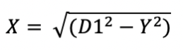

# Signal-Processing

In this project, we used Ultrasonic Sensor to detect the distance between objects and sensor with Kalman Filter, and there are three goals needed to be implemented:

* Use one ultrasonic sensor and the Kalman filter to determine the distance to an object
  

* Use two ultrasonic sensors and Kalman filter to detect the distance between sensors and objects with sensor fusion algorithm 
  

* Use two ultrasonic sensors to determine the location of an object in the X-Y plane 
  
  
## solutions

### task 1: 
Used the Kalman filter to filter the noisy duration reading from the ultrasonic sensor. The sensor is the measurement for the filter. Once filtered, a calibration equation was used to convert the duration into distance.

Calibration equation: 		                         Y = 0.1761 * (Filtered Duration) - 3.9079

### task 2:
Used two Kalman filters. The first filters the distance for the first sensor which is the measurement. The second filter then uses the first filters corrected output and error as the prediction and the second sensor as the measurement

Sensor 1 calibration equation: 		                 Y = 0.176 * (Raw Duration) - 1.8021 +(1)
Sensor 2 calibration equation: 		                 Y = 0.1743 * (Raw Duration) - 0.1179 +(1)

### task 3:
* First, determine the distance to the object and convert the duration to a distance value with the following calibration equations:

              Sensor 1 calibration equation:	Y = 0.1777 * (Raw Duration) - 56.746
              Sensor 2 calibration equation:	Y = 0.1722 * (Raw Duration) - 23.002
* Error checking:
** If a good reading is not present, then “ping” using both sensors together. Use the trigger from the one sensor and the echo from the other sensor to determine the distance
** If the reading is not good, then use the previous good reading (always saved)

* Convert the readings to X and Y values
Convert distance to a noisy X in order to calculate Y: 
    
Convert distance to Y that is more stable using the noisy X value:
    
Convert distance to more stable X using the more stable Y
    

Where D1 is sensor 1 distance reading and D2 is sensor 2 distance reading 

* Using two Kalman filters, the X and Y coordinates were filtered to provide a more accurate localization of the object
